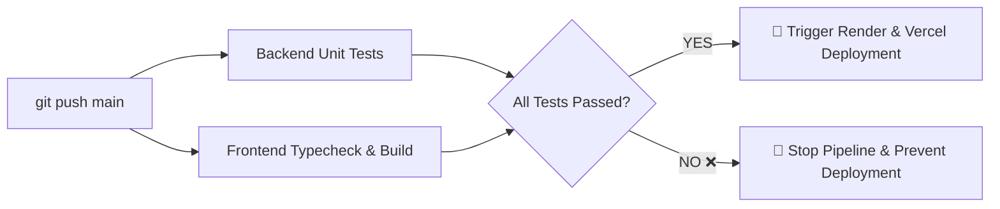

```mermaid
graph LR
    Push["git push main"] --> CI_Backend["Backend Unit Tests"]
    Push --> CI_Frontend["Frontend Typecheck & Build"]
    CI_Backend --> CD_Check{"All Tests Passed?"}
    CI_Frontend --> CD_Check
    CD_Check -- YES --> CD_Deploy["🚀 Trigger Render & Vercel Deployment"]
    CD_Check -- NO ❌ --> Cancel["🛑 Stop Pipeline & Prevent Deployment"]
```
